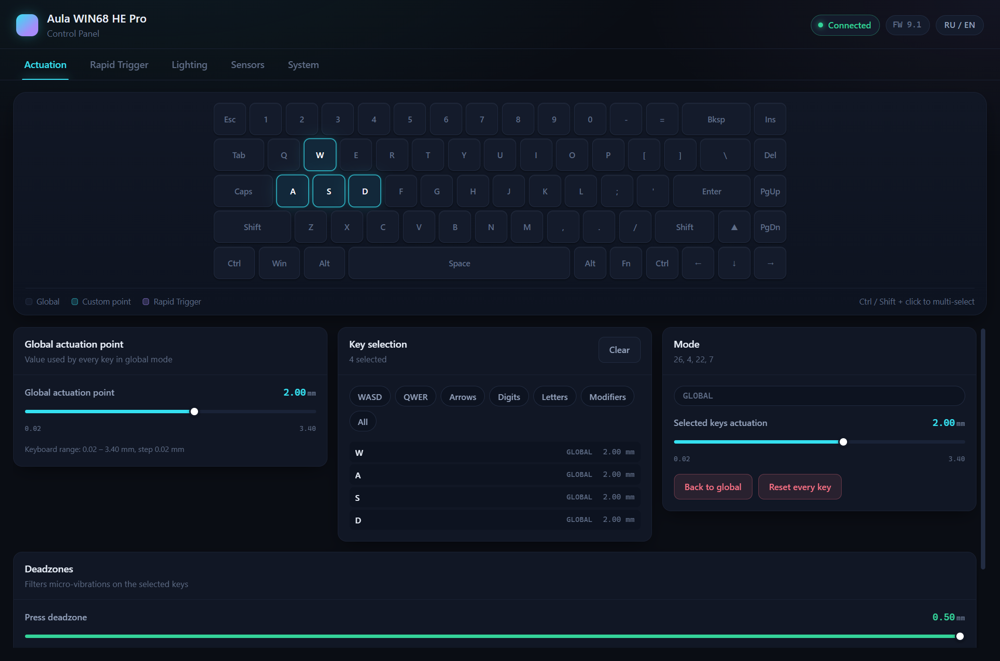
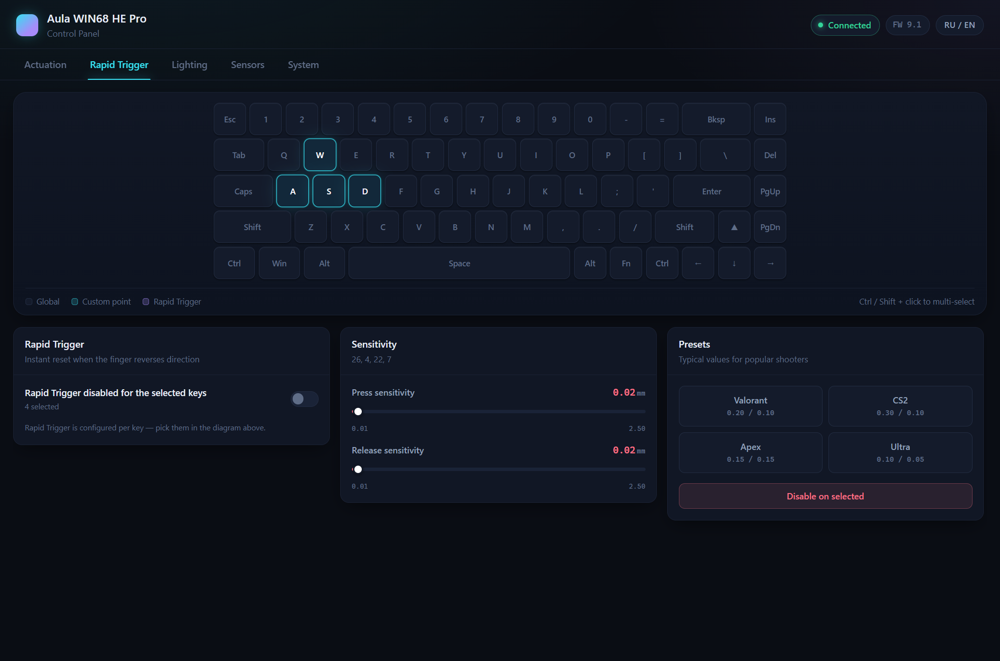
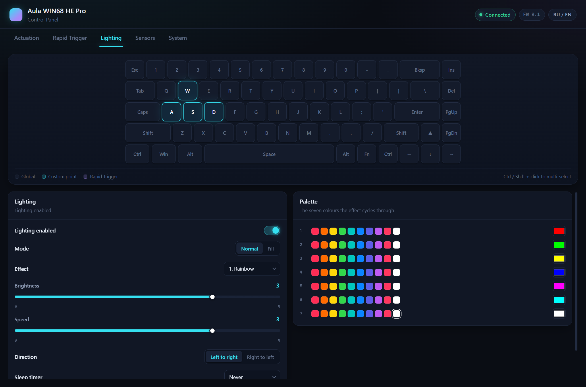
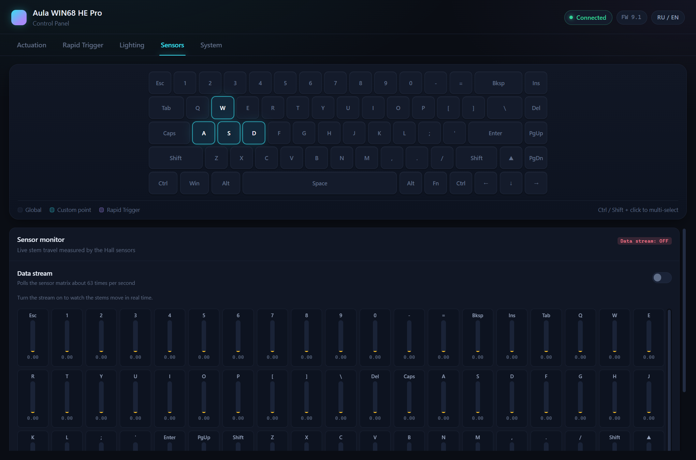
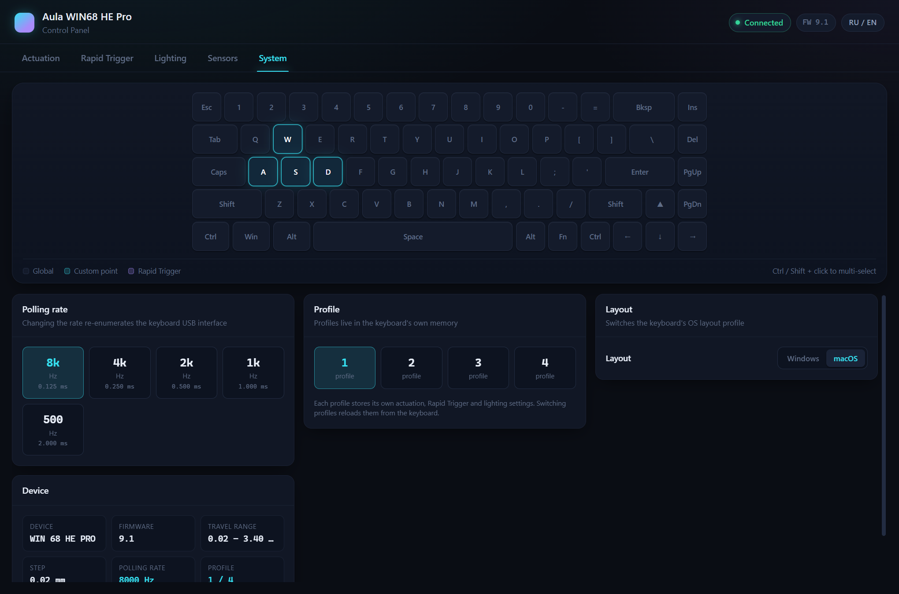

# Aula WIN68 HE Pro — Панель управления

Нативная десктопная панель управления магнитной клавиатурой **Aula WIN68 HE Pro**.
Rust + Tauri v2 на бэкенде, Preact на фронтенде, прямой доступ к HID на
vendor-интерфейсе. Без браузера, без драйверов, без интернета.

[English](README.md) · [Русский](README.ru.md)

> **Проект не связан с Aula или Aulastar.** Это независимый инструмент,
> созданный сообществом через реверс-инжиниринг USB-протокола клавиатуры,
> чтобы людям не приходилось пользоваться браузерным драйвером ради настроек.

---

## Зачем это нужно

Штатная панель управления — это веб-страница. Она работает, но медленно, при
каждом запуске просит у браузера разрешение на доступ к HID-устройству и прячет
железо за пресетами. Если хочется просто настроить клавиатуру и видеть
миллиметры, перезагрузка вкладки не нужна.

Это приложение — один .exe на 3.2 МБ, который стартует мгновенно, общается с
клавиатурой напрямую и показывает те значения, которые прошивка действительно
сообщает.

---

## Что работает

Всё перечисленное проверено записью на реальную WIN68 HE Pro с последующим
чтением обратно. Байтовые подробности — в
[docs/PROTOCOL.md](docs/PROTOCOL.md), полная матрица функций, включая то,
что **не** работает, — в
[docs/RESEARCH-NOTES.md](docs/RESEARCH-NOTES.md).

| Раздел | |
|---|---|
| **Срабатывание** | Общая точка срабатывания в диапазоне, который сообщает сама клавиатура. Индивидуальная точка для выбранных клавиш. Возврат к глобальному режиму — для выбранных или сразу для всех 68 клавиш. Мёртвые зоны нажатия и отпускания для выбранных клавиш. |
| **Rapid Trigger** | Включение RT на выбранных клавишах, раздельная настройка чувствительности нажатия и отпускания, пресеты для Valorant / CS2 / Apex / сверхбыстрый. |
| **Подсветка** | 21 эффект, яркость, скорость, направление, таймер отключения, Super Response, палитра из 7 цветов с быстрыми свотчами и полным пипетом. |
| **Датчики** | Живой поток матрицы Холла: 68 шкал с текущим ходом штока и удержанием пика. |
| **Система** | Частота опроса 500–8000 Hz с задержкой для каждого шага, 4 профиля в памяти клавиатуры, переключение раскладки Windows/macOS, полная информация об устройстве. |

Выбор клавиш общий для всех вкладок: клик выбирает клавишу,
`Ctrl`/`Shift` + клик добавляет к выбору, чипы дают наборы WASD, QWER, стрелки,
цифры, буквы, модификаторы или всё сразу. Интерфейс RU/EN.

## Состояние ожидаемых функций

Авторитетным источником протокола оказался **публичный JavaScript-драйвер
производителя**, а не прошивка. Подробности —
[`docs/VENDOR-DRIVER.md`](docs/VENDOR-DRIVER.md). Его анализ исправил несколько
выводов, которые проект раньше публиковал, поэтому сначала прочитайте этот файл.

Корректно **убрано из интерфейса**:

* **Калибровка и сброс к заводским настройкам** — таких команд не существует.
  В старом коде стояли номера 12/13, но это команды *загрузчика*
  (`BL_WRITE`/`BL_READ`); в собственном перечислении производителя там же стоят
  `START_ADJUSTING`/`SAVE_ADJUSTING`. Поэтому эти кнопки никогда ничего не делали.
* **Подсветка логотипа / боковая** (команда 25) — отклонена с `0xFF`.
* **Глобальные мёртвые зоны** — поля команды 41 читаются как ноль.
* **Rapid Switch (45)** — отправлять нельзя. Ответ выглядит корректным, но
  ничего не сохраняет, а **запись портит режим сразу пяти клавиш**. Подробности
  — [`docs/VENDOR-DRIVER.md` §6](docs/VENDOR-DRIVER.md).

**Snap Tap (44): пара сохраняется, но переключения пока нет.** Кадр долго был
неверным — старый probe слал 8-битные значения в 6-байтовой полезной части и читал
с `key_a = 0`, а такой запрос по замыслу всегда возвращает пусто. С правильным
11-байтовым кадром (динамическая задержка) пара записывается, читается обратно и
переживает переподключение, сброс работает. Не хватает поведения: нажатие не
переключает вывод, потому что поля резолвера `mode` и `type` не расшифрованы.

Поэтому вкладка **только читает и сбрасывает**. Запись заблокирована в
`src-tauri/src/lib.rs`: на реальном железе проверены две конфигурации, и одна
оставила две клавиши с непечатаемым HID-кодом. Контроль, который может молча
сломать клавиши, хуже отсутствия контроля. Подробности —
[`docs/RESEARCH-NOTES.md`](docs/RESEARCH-NOTES.md), раскладка кадра —
`docs/VENDOR-DRIVER.md` §6.

По новым данным **реализуемо**, ожидает измерения:

* **Мёртвые зоны по клавишам** теперь пишутся в раскладки **22/23**
  (`Layout_DP`/`Layout_DR`) — запись подтверждена на железе, а не 6/7, которые
  являются `Layout_DB2`/`Layout_DB3` и имеют заводские 2.0/3.0 мм, то есть выше
  точки срабатывания и способны сделать клавишу нерабочей.
* **Mod-Tap (36) и Dynamic DKS (39)** — у производителя есть интерфейс, и
  нужные feature-флаги на этой прошивке включены.
* **RGB по клавишам (42)** — флаг `DynamicLightColor` включён, значит данные,
  которые мы отбрасывали, скорее всего настоящие.

---

## Скриншоты

**Срабатывание** — схема клавиатуры и есть элемент управления. Клавиши
подкрашены по режиму, а диапазон срабатывания взят из того, что сама
клавиатура о себе сообщает.



**Rapid Trigger** — чувствительность по клавишам и готовые пресеты.



**Подсветка** — 21 эффект и палитра из семи цветов.



**Датчики** — живая матрица Холла, около 60 кадров в секунду.



**Система** — частота опроса с задержкой, профили, раскладка ОС.



---

## Установка

Скачайте последний установщик из
[Releases](https://github.com/igor-2012-killer/aula-win68-center/releases) и
запустите его. Windows x64, установка на пользователя, права администратора не
нужны.

Или соберите сами:

```sh
git clone https://github.com/igor-2012-killer/aula-win68-center
cd aula-win68-center
npm install
npm run app:build
```

Нужны Node 20+, стабильный Rust-тулчейн и WebView2 Runtime (предустановлен на
Windows 11 и актуальных сборках Windows 10).

| Команда | |
|---|---|
| `npm run app` | разработка с hot reload |
| `npm run app:build` | релизная сборка плюс NSIS-установщик |
| `npm run build` | только проверка типов и сборка фронтенда |
| `npm run tauri -- dev` | то же, что `npm run app` |

---

## Инструмент для исследования протокола

`aula-probe` — отдельная утилита для работы с протоколом. Собирается примерно за
секунду, не зависит от Tauri и подключает **тот же** код протокола, что и
приложение, поэтому всё, что она печатает, побайтово сравнимо с тем, что
отправляет приложение.

```sh
cargo run --manifest-path tools/probe/Cargo.toml --release -- --help

# что клавиатура сообщает о себе прямо сейчас
cargo run --manifest-path tools/probe/Cargo.toml --release -- state

# отправить один пакет вручную и напечатать ответ
cargo run --manifest-path tools/probe/Cargo.toml --release -- raw 5c040026ffff0000

# просканировать пространство структурных команд:
# зелёным — ответил, тусклым — эхо или устаревший пакет
cargo run --manifest-path tools/probe/Cargo.toml --release -- scan --space struct

# снять матрицу датчиков, пока вы нажимаете клавиши
cargo run --manifest-path tools/probe/Cargo.toml --release -- travel
```

Любая запись требует `--yes`, потому что меняет реальное устройство.

**Если вам что-то известно об этой клавиатуре — внутренности прошивки, более
новая версия протокола, исходники производителя — пожалуйста,
[откройте issue](https://github.com/igor-2012-killer/aula-win68-center/issues/new/choose).
Список [открытых вопросов](docs/RESEARCH-NOTES.md#open-questions) сразу покажет,
есть ли у вас то, что нам нужно.**

---

## Структура проекта

```
.
├── index.html
├── vite.config.ts
├── src/                     фронтенд на Preact
│   ├── app.tsx              оболочка: заголовок, вкладки, схема клавиатуры
│   ├── store.ts             состояние, тосты, выбор клавиш
│   ├── ipc.ts               типизированные вызовы и подписки на события
│   ├── types.ts             зеркало src-tauri/src/state.rs
│   ├── i18n.ts              строки RU / EN
│   └── components/
│       ├── Keyboard.tsx     интерактивная схема 68 клавиш
│       ├── ui.tsx           Slider, Toggle, Segmented, Select, Button, Panel
│       └── tabs/            Actuation, RapidTrigger, Lighting, Sensors, System
├── src-tauri/               бэкенд на Rust
│   ├── tauri.conf.json
│   └── src/
│       ├── protocol.rs      пакеты, чексумма, разбор ответов  (без Tauri)
│       ├── hid.rs           HID-транспорт                       (без Tauri)
│       ├── keymap.rs        физическая раскладка 68 клавиш      (без Tauri)
│       ├── state.rs         сериализуемая модель состояния
│       ├── device.rs        I/O-поток, чтение, запись, поток датчиков
│       └── lib.rs           команды и валидация входных данных
├── tools/probe/             отдельный CLI для исследования протокола
└── docs/
    ├── PROTOCOL.md          протокол, смещения байтов, реальные дампы пакетов
    ├── RESEARCH-NOTES.md    что работает, что нет, открытые вопросы
    ├── ARCHITECTURE.md      как устроено приложение
    └── screenshots/
```

Три модуля, помеченные *без Tauri*, подключаются в `tools/probe` по пути
исходника — благодаря этому та утилита почти без зависимостей.

---

## Документация

| | |
|---|---|
| [docs/VENDOR-DRIVER.md](docs/VENDOR-DRIVER.md) | **Начните отсюда.** Перечисления команд и раскладок, feature-флаги по версии протокола и настоящие кадры Snap Tap / Rapid Switch, восстановленные из публичного JS-драйвера производителя |
| [docs/PROTOCOL.md](docs/PROTOCOL.md) | Формат кадра, все команды, смещения байтов, реальные пакеты, особенности железа |
| [docs/RESEARCH-NOTES.md](docs/RESEARCH-NOTES.md) | Работающие функции, тупики с перечнем попыток и открытые вопросы |
| [docs/ARCHITECTURE.md](docs/ARCHITECTURE.md) | Модель I/O-потока, валидация ответов, hotplug, границы модулей, тесты |
| [CONTRIBUTING.md](CONTRIBUTING.md) | Как собрать, протестировать и помочь проекту, включая правила работы с железом |

---

## Тесты

```sh
# разбор протокола, раскладка, round-trip режимов — без железа
cargo test --manifest-path src-tauri/Cargo.toml --lib
npm run build                 # tsc --noEmit + vite build

# тесты транспорта и записи на реальной клавиатуре
cargo test --manifest-path src-tauri/Cargo.toml --lib -- --ignored hardware
```

Железные тесты **пишут в клавиатуру и затем восстанавливают изменённое**.
Сериализация обеспечена мьютексом внутри тестового модуля, поэтому
`--test-threads=1` больше не нужен. Проверяйте `aula-probe state` до и после
прогона — вывод должен совпадать.

---

## Участие в проекте

Контрибьюции очень приветствуются, особенно находки по протоколу — подробности
в [CONTRIBUTING.md](CONTRIBUTING.md), а список того, чего ещё не хватает, — в
[docs/RESEARCH-NOTES.md](docs/RESEARCH-NOTES.md#open-questions).

Владельцем этой клавиатуры быть не обязательно. Документация, переводы, работа
с интерфейсом, тесты на основе пакетов и сборка под платформы — всё это ценно.

---

## Лицензия

[MIT](LICENSE) © участники проекта aula-win68-center
